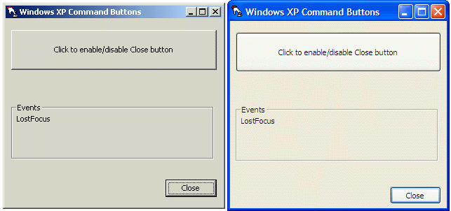



## REAL Windows XP Command Buttons\!

### Description

Did you know that VB 5/6 applications will not render their controls with the new visual themes under Windows XP? Obviously, this is not good. This is the solution to this problem. This creates a REAL themed button under Windows XP by calling the Theme APIs, all wrapped up into an easy to use control. All you have to do is drop this control in your forms in place of the regular command button. Plus, as an added bonus, this control is completely backwards compatible! If the OS that your program is running on does not support Themes (or if they are disabled), this control simply displays the standard command button, without any extra work by you. This will give your applications a truely professional touch!
 
### More Info
 

             |
---                |---
**Submitted On**   |2001-09-30 18:31:04
**By**             |[Doctor Evil](https://github.com/Planet-Source-Code/PSCIndex/blob/master/ByAuthor/doctor-evil.md)
**Level**          |Intermediate
**User Rating**    |5.0 (35 globes from 7 users)
**Compatibility**  |VB 4\.0 \(32\-bit\), VB 5\.0, VB 6\.0
**Category**       |[Custom Controls/ Forms/  Menus](https://github.com/Planet-Source-Code/PSCIndex/blob/master/ByCategory/custom-controls-forms-menus__1-4.md)
**World**          |[Visual Basic](https://github.com/Planet-Source-Code/PSCIndex/blob/master/ByWorld/visual-basic.md)
**Archive File**   |[REAL Windo272419302001\.zip](https://github.com/Planet-Source-Code/doctor-evil-real-windows-xp-command-buttons__1-27673/archive/master.zip)

